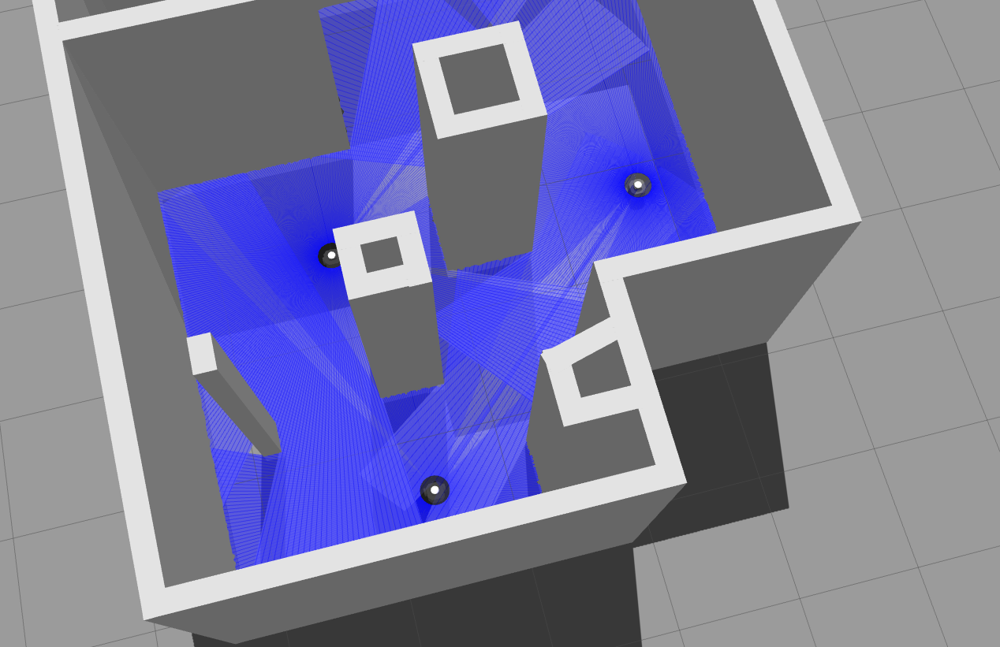
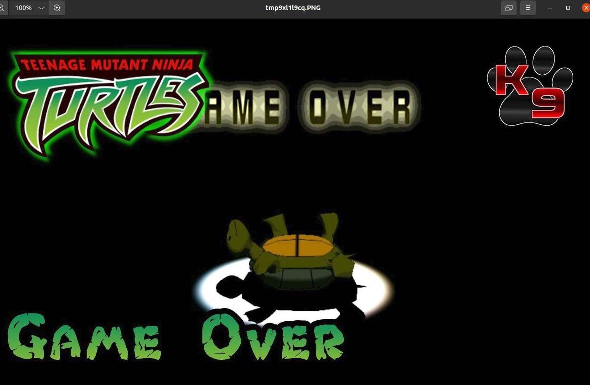

# Final Project World 

## Adding the scripts to your directory 
Follow this directory https://github.com/jn89b/unmanned_systems_ros2_pkg/tree/main/unmanned_systems_ros2_pkg/scripts

Download the following scripts and put it in your respective "scripts" directory:
- foot_ninja_1.py
- foot_ninja_2.py
- foot_ninja_spawn.py
- dungeon_master.py

## Add launch files to your launch directory
Follow this directory https://github.com/jn89b/unmanned_systems_ros2_pkg/tree/main/unmanned_systems_ros2_pkg/launch

Download the following launch files and put it in your directory 
- foot_ninja_move.launch.py
- final_project.launch.py
- hlds_laser.launch.py


## Update your cmake lists with the scripts 
On your CMakeLists.txt update your install with the scripts you have put in your directory, it should look a little something like this https://github.com/jn89b/unmanned_systems_ros2_pkg/blob/f896d9cb2b07783878707265da897ac88d64a67c/unmanned_systems_ros2_pkg/CMakeLists.txt#L40C6-L40C6

## Colcon build the updated code
go back to your top level directory and do the following
```
cd ros2_ws/ # if you haven't changed directory to your workspace
colcon build --symlink-install --packages-select unmanned_systems_ros2_pkg 

```

If this is good we are ready to launch the world 

## Launch the world and make the foot ninjas move 
Spawn the world by doing the following command :
```
ros2 launch unmanned_systems_ros2_pkg final_project.launch.py  
```

You should see a world like this 


To make the foot ninja's move, execute the following command:
```
ros2 launch unmanned_systems_ros2_pkg foot_ninja_move.launch.py 
```

## Initial Conditions of Environment 
- Start location:
  - [-3, -3]
- End location:
  - [0.25, -5] (the beer can)
- Mobile Adversaries:
  - One at location [-1.2, -5.75] 
  - One at location [-1.3, -3.0]

- Known Obstacles:
  - [-2.75, -2.25] 
  - [-2.5, -3.5]


Your job is to run your algorithm to avoid the field of view from your adversaries if you are within the field of view (within its sphere), a game over will be popeed un the screen. As shown below
